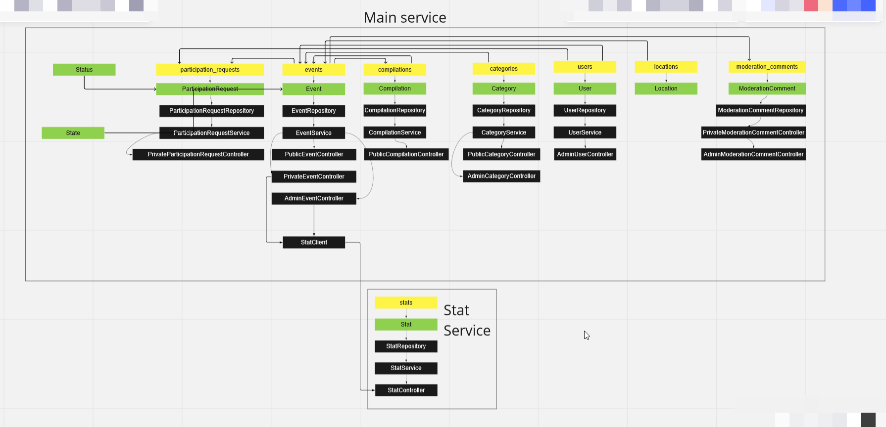

Ссылка на pull request: https://github.com/slava64/java-explore-with-me/pull/1

## REST API для приложения ExploreWithMe
ExploreWithMe позволяет просматривать, делиться и принимать участие в интересных событиях. 

### В приложении есть три точки доступа 
- публичная (доступен для всех пользователей)
- приватная (доступ только у владельца своих событий)
- административная (доступ только через VPN)

### ExploreWithMe состоит из двух сервисов:
1. Основной сервис, где собран весь функционал. [Спецификация API](https://raw.githubusercontent.com/yandex-praktikum/java-explore-with-me/main/ewm-main-service-spec.json) (для просмотра необходим редактор Swagger)
2. Сервис статистики, для сбора информации о просмотрах событий. [Спецификация API](https://raw.githubusercontent.com/yandex-praktikum/java-explore-with-me/main/ewm-main-service-spec.json)


### Запуск приложения и требования:
Для запуска приложения необходимы предустановленные плагин maven и программа docker.
#### Комманды для запуска приложения из под консоли:
- компиляция jar файла
```
mvn clean compile
```
- собрать docker контейнеры
```
docker-composer up
```

Приложение будет доступно по ссылке http://localhost:8080

## База данных

## Структура данных
